> 文章比较长，建议打开侧边大纲阅读。

# obsidian-Kanban-MOC-demo

这是一个看板MOC插件的演示库。

使用方法：直接下载解压使用 obsidian 打开。

相关链接：

- 看板MOC插件：[1657744680/obsidian-Kanban-MOC: 自用插件 (github.com)](https://github.com/1657744680/obsidian-Kanban-MOC)
- 带注释的官方插件示例：[obsidian-plugin-sample-notes (github.com)](https://github.com/1657744680/obsidian-Kanban-MOC)

# 前言

本人菜鸡，对 JavaScript 的了解就只有最基础的知识，代码写的也很烂，大佬勿喷。
希望这个教程能方便大家了解 obsidian 插件的开发流程，我个人感觉有点编程基础的话，做个简单的插件还是挺容易上手的。

这个展示库有两个目的：

1. 记录一个初次的 obsidian 开发过程
2. 展示这个开发的插件的功能、使用方法

下面就两个目的进行叙述：

1. 先叙述 obsidian 插件的开发上手
2. 再结合例程讲讲插件的开发流程，代码及对应的功能
3. 最后展示我开发的插件的完整使用

# 一、obsidian 插件开发上手

## 1、尝试下载插件示例并在obsidian中启用

1. 下载并解压[插件示例](https://github.com/obsidianmd/obsidian-sample-plugin)，并将其放在 obsidian 库（可以新建、复制一个库用来开发）的插件文件夹下
2. 自行下载 node.js，配置好开发环境
3. 进到插件示例文件夹下，使用 `npm i` 命令安装依赖（只用整一次）
4. 接下来要使用命令：`npm run dev` 会实时监测文件变化，将 `main.ts` 文件编译成 `main.js` 文件
5. 编译完成后这时就可以在 obsidian 中启用该插件了。

## 2、插件示例文件结构

先来看插件示例文件的结构：

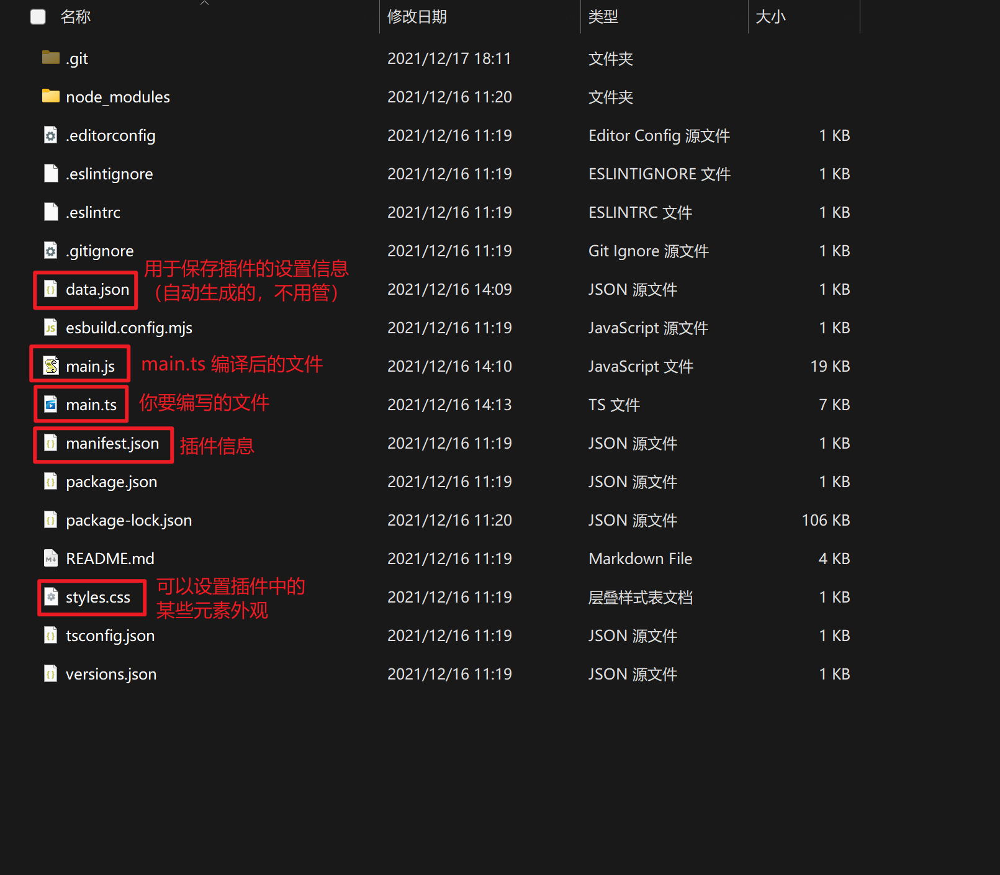

标红的是几个重要的文件，需要开发者进行编辑的主要就是以下 3 个文件：

- main.ts
- manifest.json
- style.css

重中之重肯定就是 main.ts 文件了，接下来开始看 ts 文件

## 3、用 vscode 打开插件示例（带注释的官方插件示例）

我在main.ts中写了点儿注释（我也不知道对不对），已经上传到GitHub了，有兴趣的可以瞅瞅：[obsidian-plugin-sample-notes (github.com)](https://github.com/1657744680/obsidian-plugin-sample-notes)。下载后解压同样放在obsidian的插件文件夹下，然后 `npm run dev`。

这是 main.ts 的总体结构：

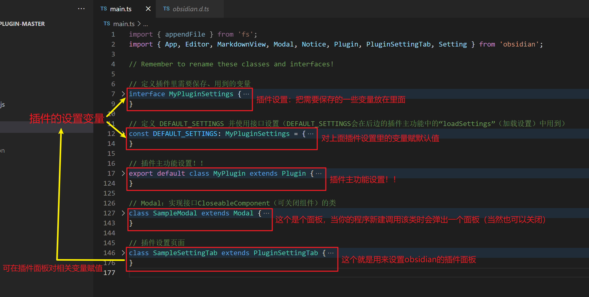

点开详细看，我在[obsidian-plugin-sample-notes (github.com)](https://github.com/1657744680/obsidian-plugin-sample-notes)里面写了些注释，例如：

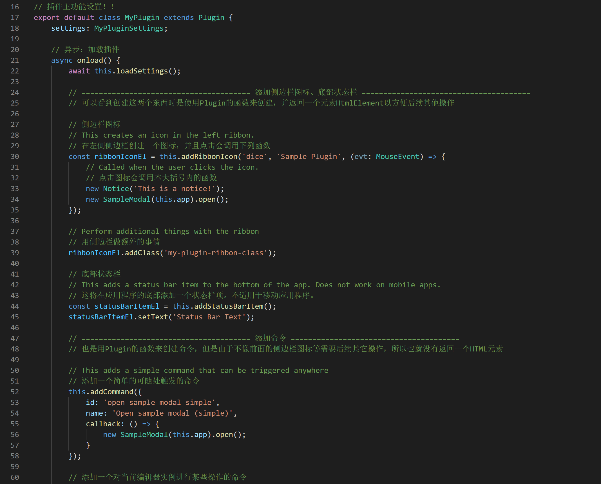

看 main.ts 文件，自己改改参数，然后重新加载 obsidian 中的该插件，看在 obsidian 中会有什么变化。

看完之后就大致明白如何创建一个命令等等（就是抄代码）

## 4、hot-reload 插件辅助开发

**现在总结下开发流程**：

1. 在插件文件夹下 npm i（仅需设置一次）
2. 然后 npm run dev，这会实时监测 ts 文件变化并将其编译成 js文件
3. 编辑 main.ts 文件
4. 保存更改，最后去obsidian重新加载开发中的第三方插件，然后就可以看到更改

第 4 步手动重载插件比较麻烦，所以可以用 [hot-reload](https://github.com/pjeby/hot-reload) 这款 obsidian 插件来实现自动重新加载发生变化的插件。
当装上这款插件后，开发流程就变成了下面这样：

1. 在插件文件夹下 npm i（仅需设置一次）
2. 手动安装 [hot-reload](https://github.com/pjeby/hot-reload) 插件并启用（仅需设置一次）
3. 然后 git init（仅需设置一次）（需要安装 git），只有这样 hot-reload 才会重载该插件。
4. 然后 npm run dev，这会实时监测 ts 文件变化并将其编译成 js文件
5. 编辑 main.ts 文件
6. 保存更改，最后去obsidian就可以看到更改

现在就可以不用手动重载开发的插件了。

# 二、结合例程讲讲如何开发插件

## 先定一个小目标😉（功能需求）

假设现在我想开发个简单的插件，名字就叫：demo-simple-plugin
我希望这个插件具有以下功能：

1. 有一条**命令**，且当我调用这条命令时，它会同时弹出一条通知和一个面板
   1. **通知**：展示一句**欢迎语**
   2. **面板**：展示**当前打开的文档的一些相关信息**
2. 还有一个**设置面板**，我可以在里面**自定义通知的欢迎语**。

好，现在开始开发。 

## 1、下载、解压官方插件示例

假设已经安装 hot-reload 插件了，然后在下载的官方插件示例中 npm i、git init、npm run dev

我把这个插件文件夹更名为插件名：demo-simple-plugin

接下来用 vscode 打开这个插件文件夹

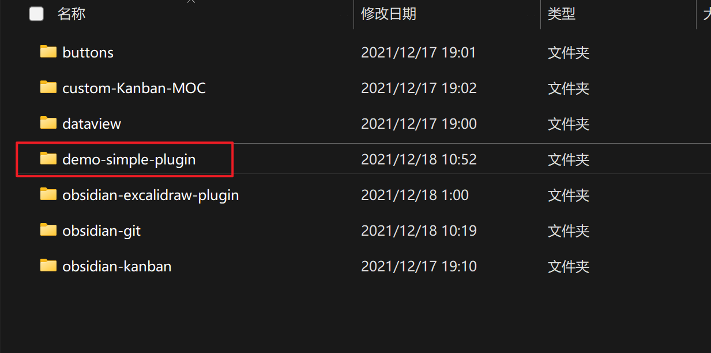

## 2、编辑插件信息：manifest.json

obsidian 会识别这个文件作为插件信息（很简单就不多说了）

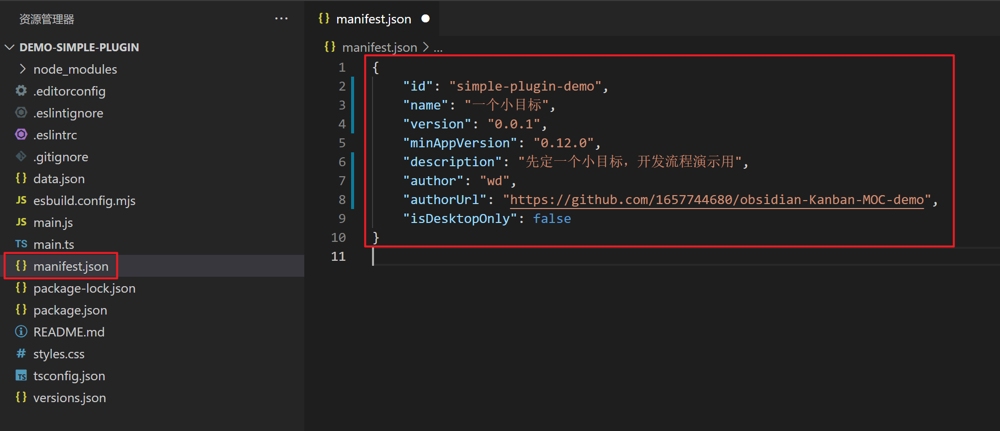

然后在obsidian中找到启用该插件：

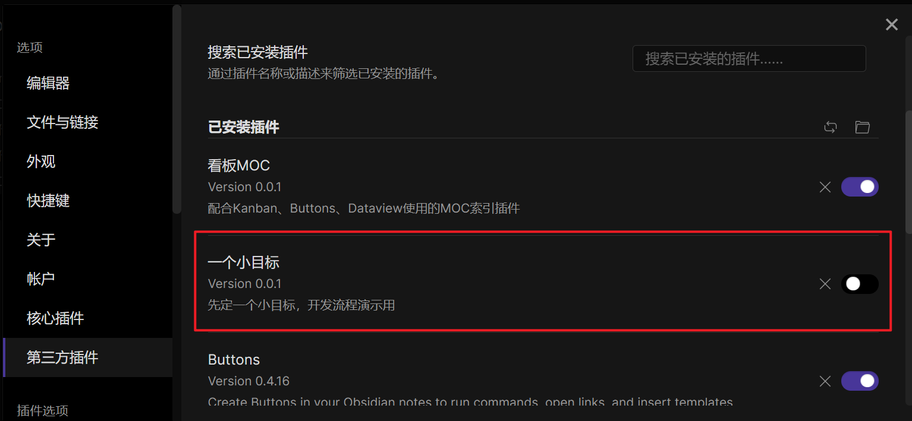

## 3、⚠️重点：编辑 main.ts 文件

使用 vscode 打开 main.ts 文件。

前面提到了 main.ts 的大致结构：

### 设置变量 MyPluginSettings

根据功能需求可知，欢迎语需要能够自定义，所以欢迎语肯定是要保存的。

根据上图，我们很容易能够看到应该在哪里设置变量：
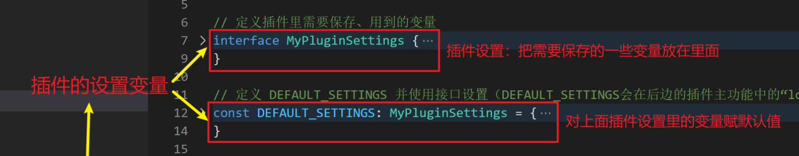

将欢迎语设置为变量：welcomeStr，并赋默认值："欢迎来到 obsidian"
也就是下面这样：
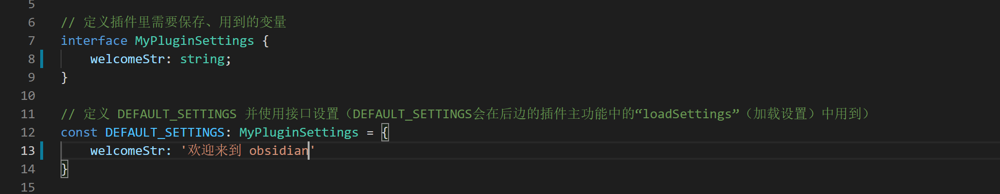

❓那么这个变量怎么被调用加载呢？
详见：[加载设置 loadSettings](#加载设置-loadsettings)

❓又是怎样修改个变量的值呢？
详见：[保存设置 saveSettings](#保存设置-savesettings)

### 编写插件设置面板 PluginSettingTab

注意：这里只是编写插件设置面板，除此之外还需要在 [插件启用 onload](#插件启用-onload) 中把该面板添加到设置里去

先看下原来的设置页面：
可以看到这个设置页面的内容有一个h2标题、一个设置项。
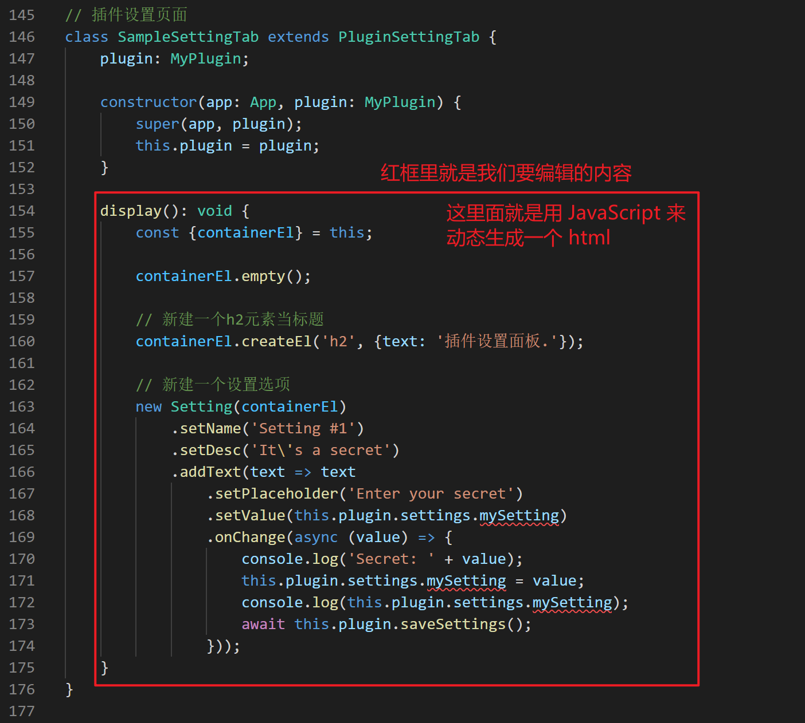

我们要把原来的mySetting改成我们刚刚设好的 welcomeStr，如下图所示：
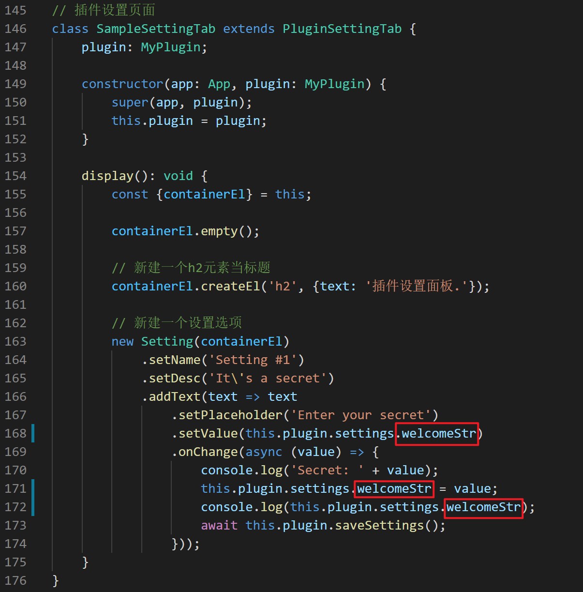

### 插件 Plugin

插件程序的大致结构如下图：**我们主要编程的位置是** **async onload()**，其它 3 个了解即可。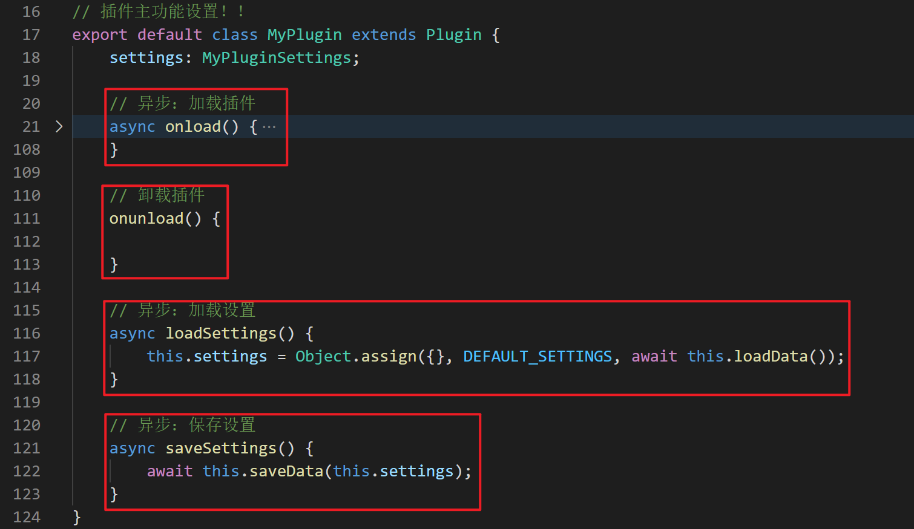

#### 插件启用 onload()

这里就是主要编程的地方了，你将在这里进行命令、侧边按钮、底部状态栏、设置面板、事件监听等等的添加。

下面我们要在这里添加：

- 一条命令：
  - 弹出通知：显示设置中的 welcomeStr
  - 弹出面板：显示当前选中的文档的文档名

- 一个设置面板：刚才我们已经编写过插件设置面板了，在这里要做的是把编辑好的面板添加到插件中去

##### 添加一条命令并令其弹出通知

先让它发出通知，通知内容为我们设置的欢迎语：welcomeStr。
copy 官方的示例代码自己改下：
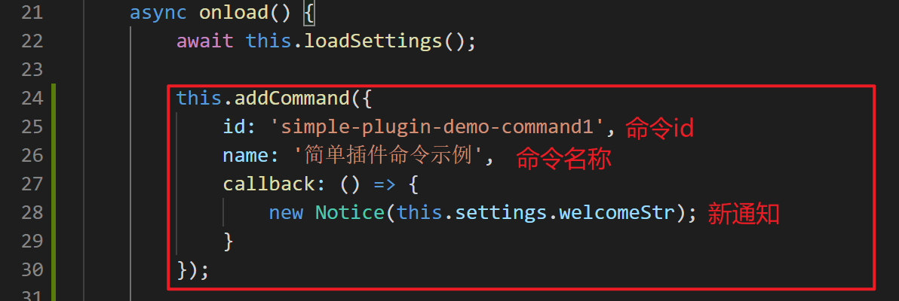

保存去 obsidian 点击 Ctrl+P 调查命令，可以看到已经有我们刚才改动的新命令了：
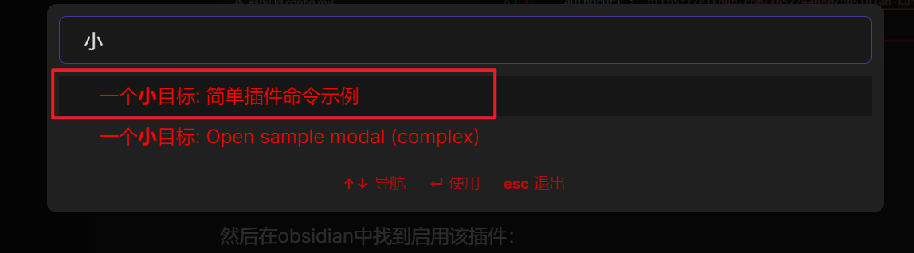

点击命令会看到obsidian右上角出现通知，通知内容为我们设置的默认值：
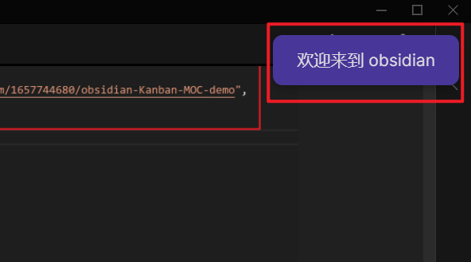

##### 为该命令添加弹出面板

首先在刚才添加命令的程序快里添加代码，打开一个官方示例的面板：
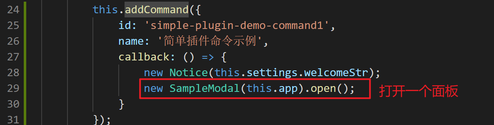

现在来编辑这个官方的示例面板：
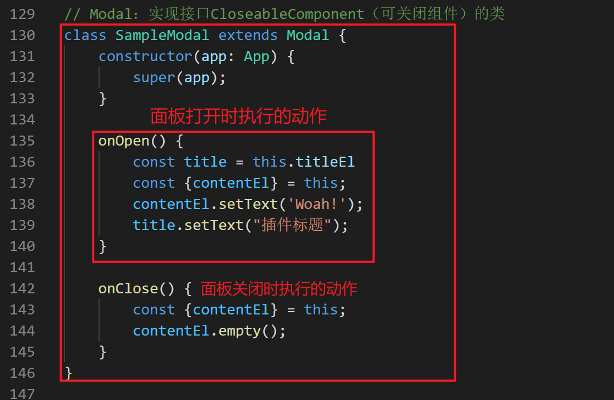

我们在 onOpen() 里编辑下，设置标题、显示的内容：
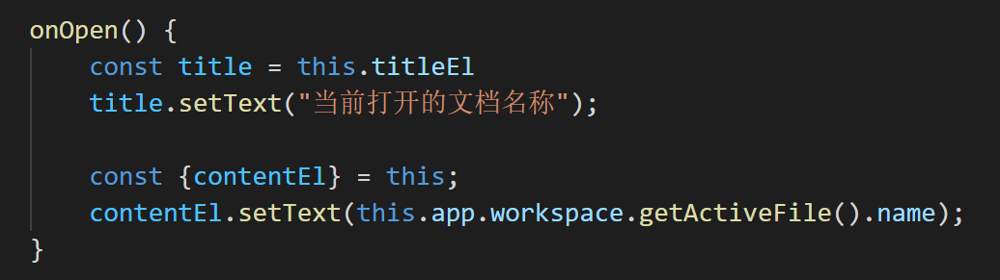

保存更改去 obsidian 里调用该命令并观察变化：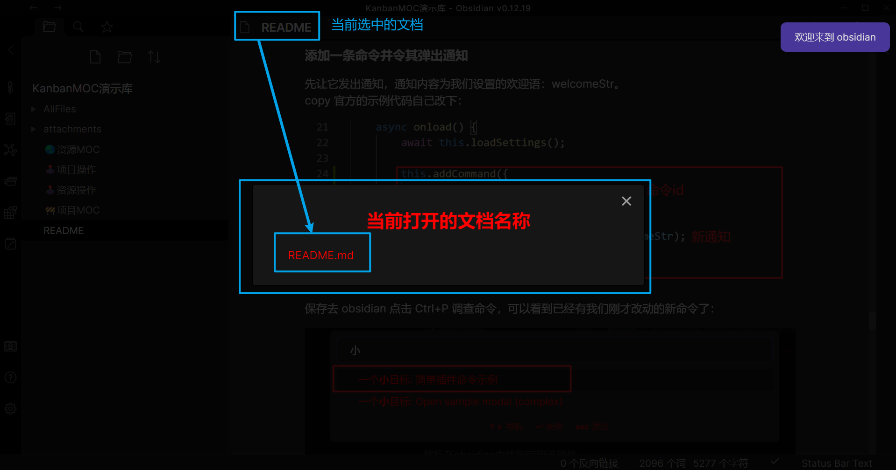

##### 把设置面板添加到插件里

继续在 onload() 里编辑，还是照抄官方示例代码，添加一个插件设置页：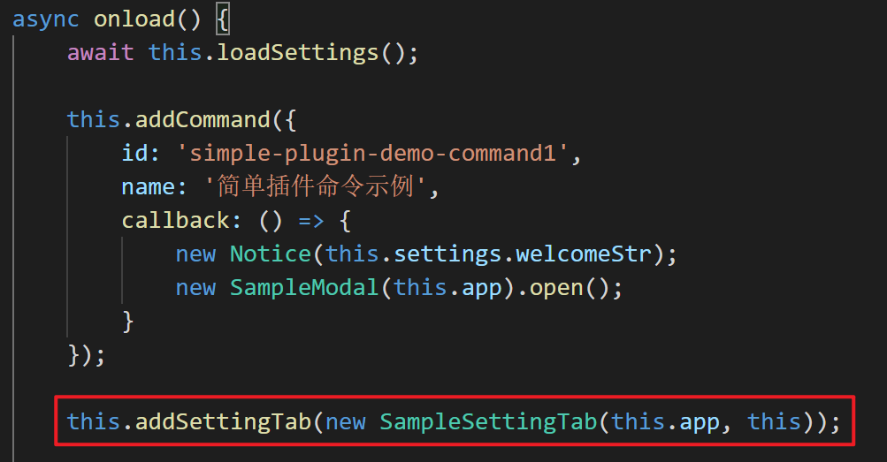

这个插件设置页我们在前面就编辑过了：[编写插件设置面板 PluginSettingTab](#编写插件设置面板-pluginsettingtab)

保存更改并进到 obsidian 查看插件设置面板：
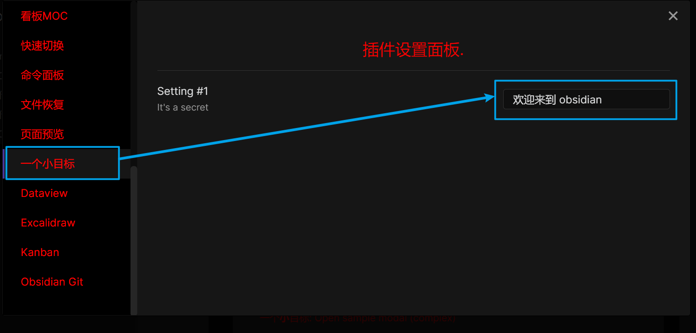

#### 插件禁用 onunload()

> 你可以在这里设置一些动作，当插件被禁用时会执行

#### 加载设置 loadSettings

❓设置变量怎么被加载的呢？

回到刚才的设置变量，右键 DEFAULT_SETTINGS，查看谁引用了它
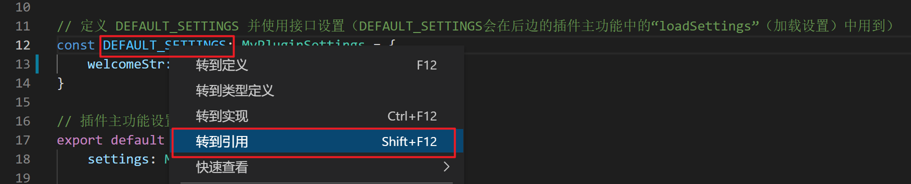

页面会跳到加载设置 loadSettings()：
可以看到加载设置里除了 DEFAULT_SETTINGS 外，还有个 loadData() 的值，它们被赋值给 this.settings。
其中的 loadData() 加载的是保存设置时生成的 data.json 文件。
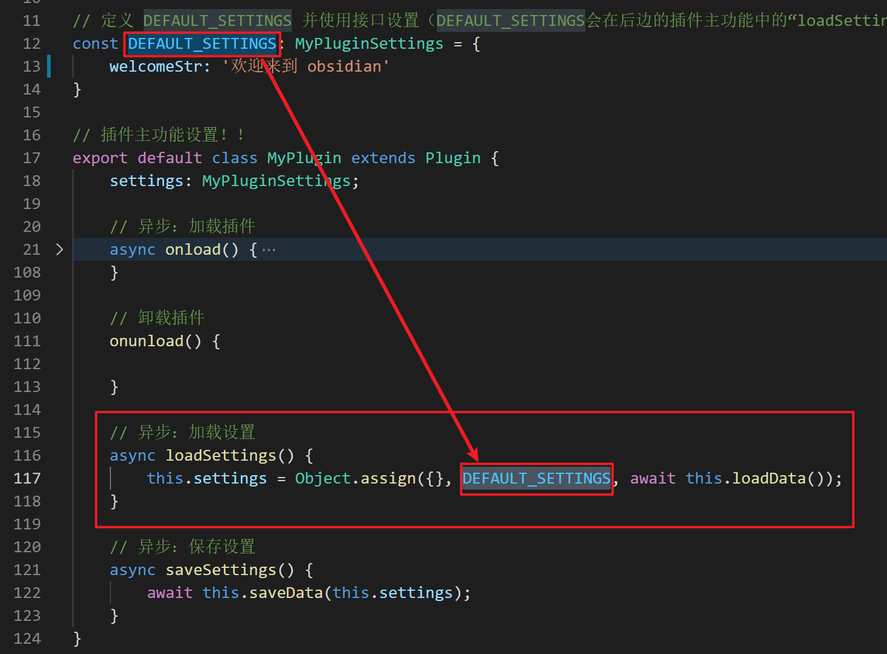

❓设置变量又是什么时候被加载呢？即什么时候调用的这个 loadSettings()？

同样右键转到引用：
可以看到在插件被加载的时候会调用加载设置。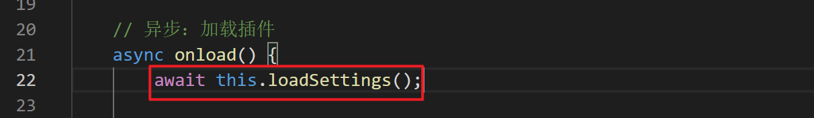

#### 保存设置 saveSettings()

可以看到是把 this.settings 保存到生成的 data.json。

❓那么什么时候保存设置呢？即什么时候会调用 saveSettings() 呢？
同样跳转到引用：可以看到设置面板中的设置项的文本发生变化（onChange）时会调用 savaSettings() 来保存设置。
（当然你也可以根据自己的程序来调用保存设置）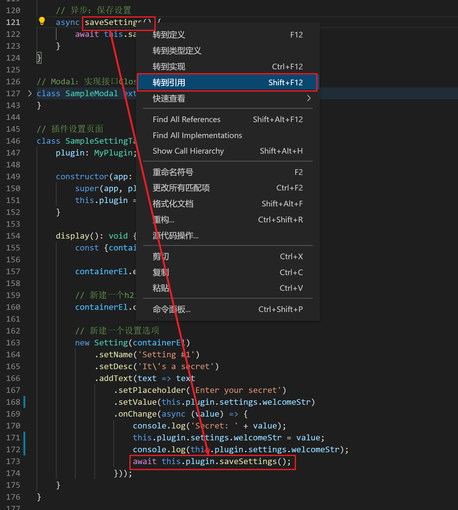

## 4、编辑 style.css

在这里设置一些样式：
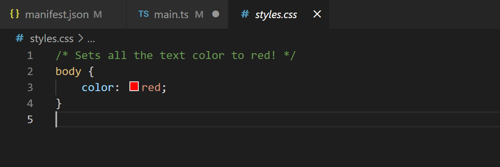

主体红字太难受了，我就把这个删了……

## 5、完成开发

至此，这个简单的插件就开发完成了。

还需要最后一点小步骤，因为obsidian实际运行需要的插件文件只有以下几个红框标注的文件，所以开发完成后可以把仅保留这几个文件的文件夹复制到别的库中，然后就可以用插件了（这里我就不删除了）：
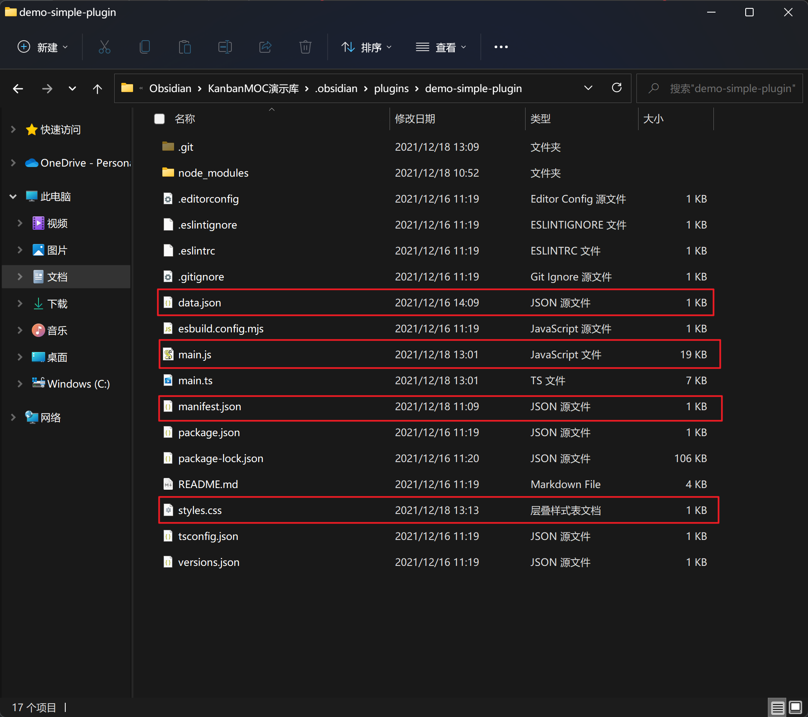

# 三、我开发的插件：看板MOC

- 我喜欢把笔记分两种类型：资源、项目
- 一个资源（或项目）可能有多个笔记和附件，我喜欢把一个资源（或项目）的笔记和附件放在同一个以资源（或项目）名称命名的文件夹下。
  （附件放在该文件夹的attachments文件夹中）
- 入口文档：每个具体的资源（或项目）文件夹中都有一个和该文件夹同名的文档，这个文档的作用是对当前文件夹下的其它文档进行管理索引。
- 根据上述我的喜好，有必要说明下我的obsidian做了些设置以便把一个资源（或项目）的笔记、附件放在同一个文件夹：
  - 笔记附件插入后的存放位置：当前编辑笔记所在文件夹下的attachments文件夹
  - 新建笔记位置：当前编辑笔记所在文件夹

我已经在演示库中我已经事先新建好了 2 个资源、项目：

- 一个资源文件：obsidian
- 一个项目文件：obsidian看板MOC插件

## 插件准备、设置

### 1、手动创建部分文件

看板MOC插件需要事先手动准备的文件如下：

- 一个总文件夹（需位于根目录）（新建的资源、项目会放在这里面）
- 两个MOC文档（需位于根目录）（二者需皆为看板模式，并且有至少一个列）
- 一个模板文件夹（一个你不容易误删除的路径）
  - “资源-模板.md”（创建新资源时用到的模板）
  - “项目-模板.md”（创建新项目时用到的模板）

需要手动创建的文件如下图所示（除了模板文档不能自定义名称外，其它都可以自定义名称）：
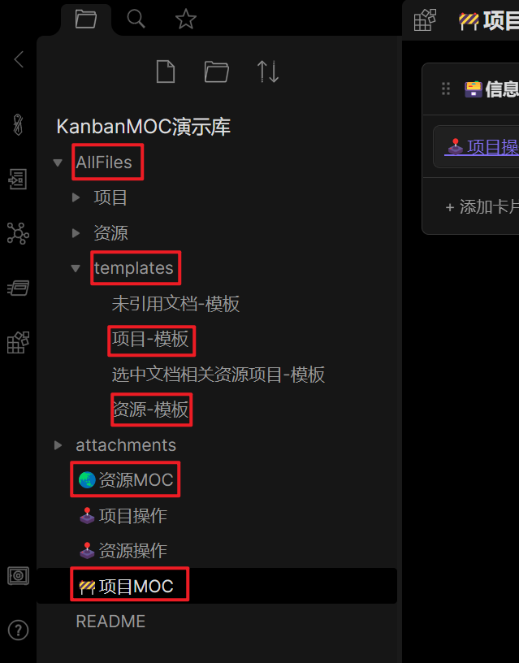

### 2、进入插件设置面板设置参数

这个跟上面事先手动准备的文件有关

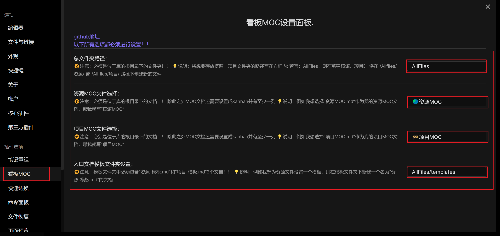

## 插件使用

这 2 个MOC文档用于管理所有资源、项目文件的索引。

而“看板MOC”插件就是用来辅助MOC文档进行管理，自动创建文件、更新索引。

### 1、插件命令介绍

Ctrl+P 打开命令，输入“看板MOC”，可以看到一共有 7 条命令：
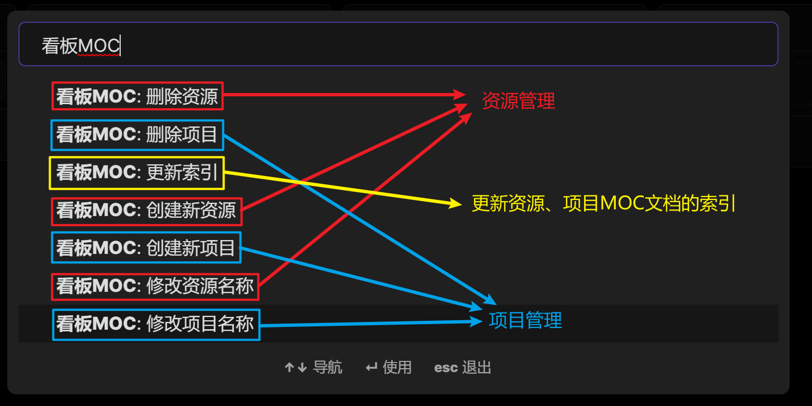

### 2、使用示例：管理一个名为"测试"的资源

接下来通过一个示例展示如果使用插件辅助管理资源、项目。

#### 2.1、创建新资源：测试

打开命令面板，调用命令`看板MOC: 创建新资源`，在弹出的面板中输入新资源名称"测试"：
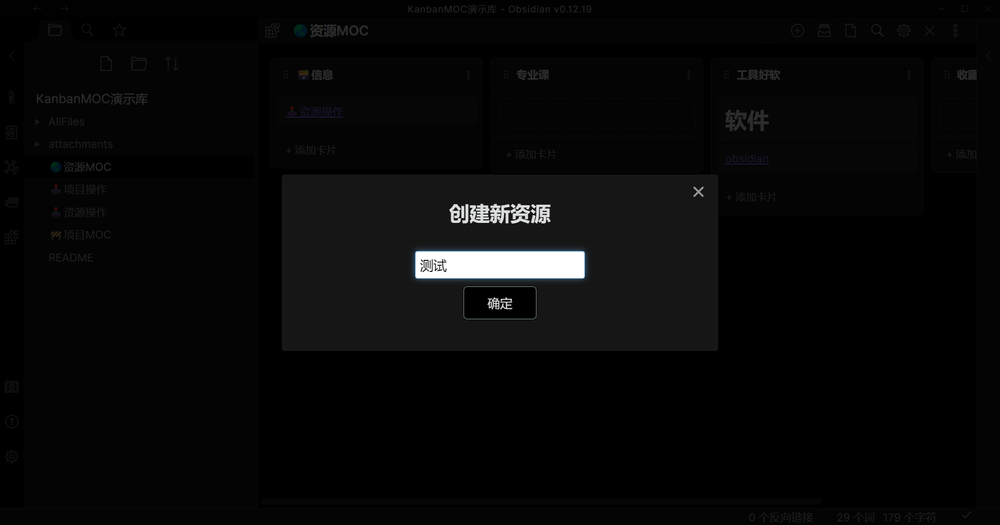

点击确定，新建完成后关闭面板。回到🌏资源MOC文档，可以看到现在新增了一个名称为“测试”的卡片：
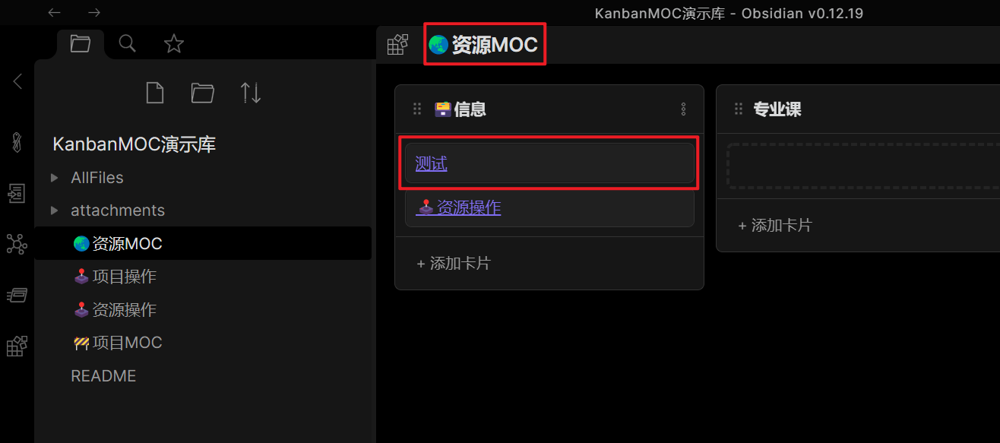

点击“测试”跳转至该页面，这个页面是调用事先创建的模板文件创建的：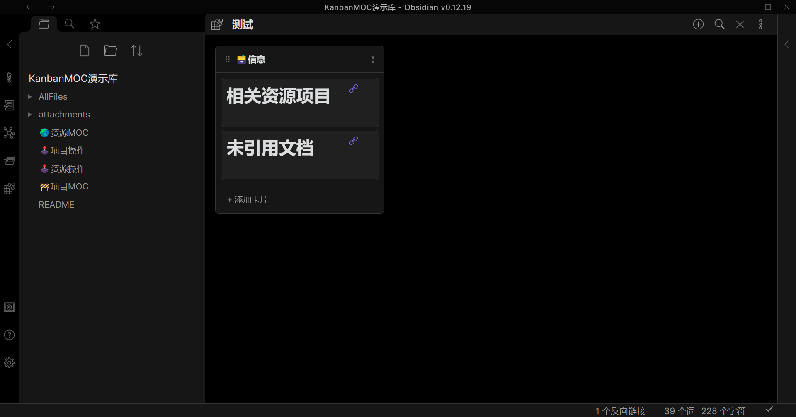

同样在文件管理中你也可以看到，它在`AllFiles/资源`路径下新建了一个路径为`AllFiles/资源/测试/测试.md`文件：
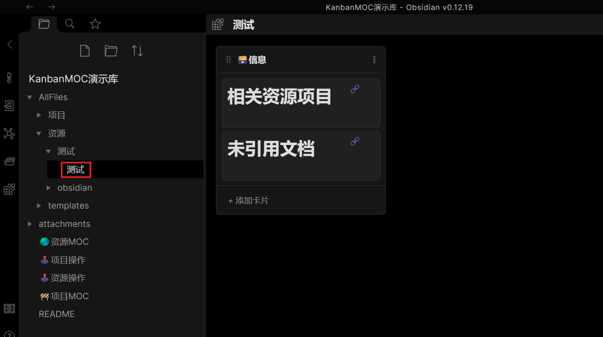

#### 2.2、删除资源MOC对“测试”的索引，然后更新索引

下面回到🌏资源MOC，删除卡片“测试”，这个时候这个索引没有了。
接下来运行命令：`看板MOC: 更新索引`，会再次索引未被索引的资源入口文档，并在资源MOC最左边的一列添加未被索引的文档的卡片：
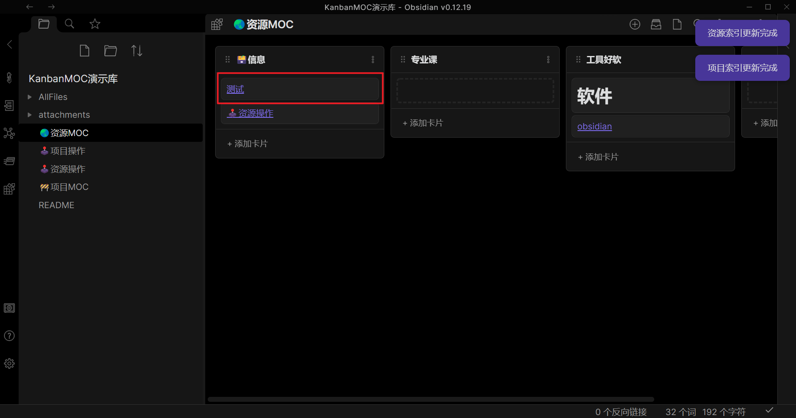

> 有了这个命令就可以把一个项目文件夹移动到资源文件夹，然后点击更新索引

#### 2.3、修改资源“测试”的名称为：测试2

运行命令：`看板MOC: 修改资源名称`，修改资源“测试”的名称为：测试2
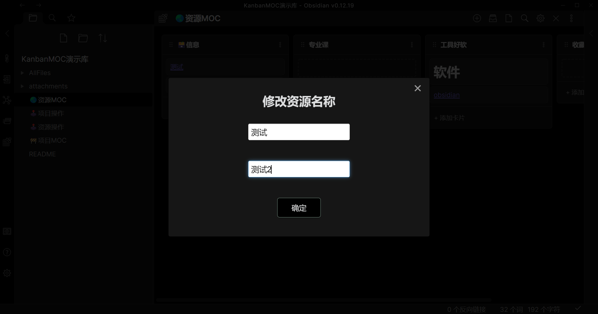

修改成功后关闭面板，回到资源MOC，看到索引也会改变：
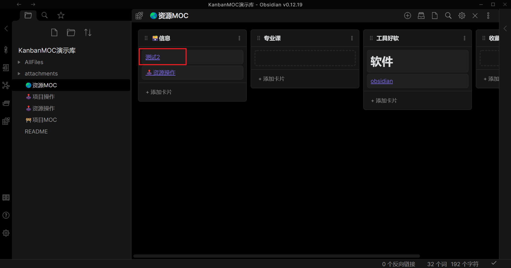

打开文件管理，可以看到此时文档的路径变为：`AllFiles/资源/测试2/测试2.md`
注意：文件名（入口文件）和文件所在的文件夹都改名了。（因为入口文档要保持和文件夹同名）

#### 2.4、删除名为“测试2”的资源

运行命令：`看板MOC: 删除资源`，输入资源名称“测试2”，然后手动输入：“确认删除”，点击确定删除文件：
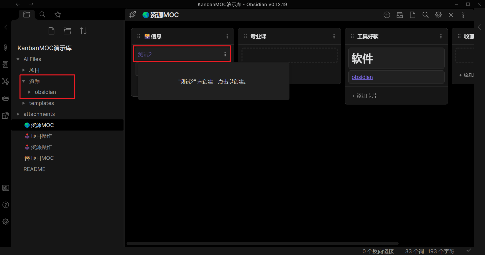

可以看到删除是直接删除这个资源（或项目）文件夹。电脑端删除的文件会放在回收站（手机端删了我也不知道去哪😵‍💫）

> 删除资源（或项目）时目前不会自动删除MOC中对该资源（或项目）索引的卡片，需要手动删除。

# 参考链接

[（转载）Obsidian 开发相关（简单引导） - 开发讨论 - Obsidian 中文论坛](https://forum-zh.obsidian.md/t/topic/148)

看板MOC插件：[1657744680/obsidian-Kanban-MOC: 自用插件 (github.com)](https://github.com/1657744680/obsidian-Kanban-MOC)

看板MOC插件展示库：[1657744680/obsidian-Kanban-MOC-demo: 看板MOC插件的演示库 (github.com)](https://github.com/1657744680/obsidian-Kanban-MOC-demo)

带注释的官方插件示例：[obsidian-plugin-sample-notes (github.com)](https://github.com/1657744680/obsidian-plugin-sample-notes)
